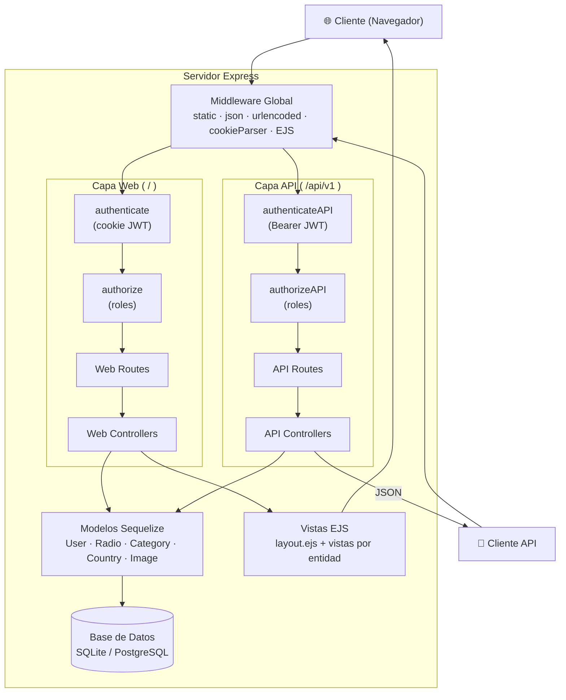
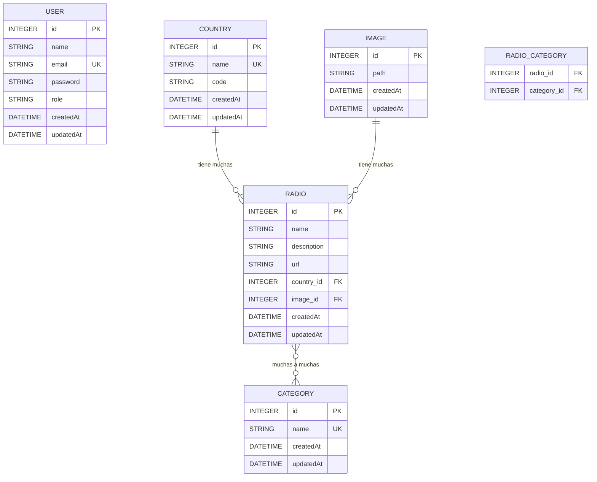
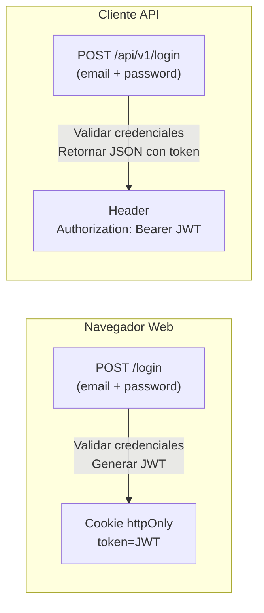
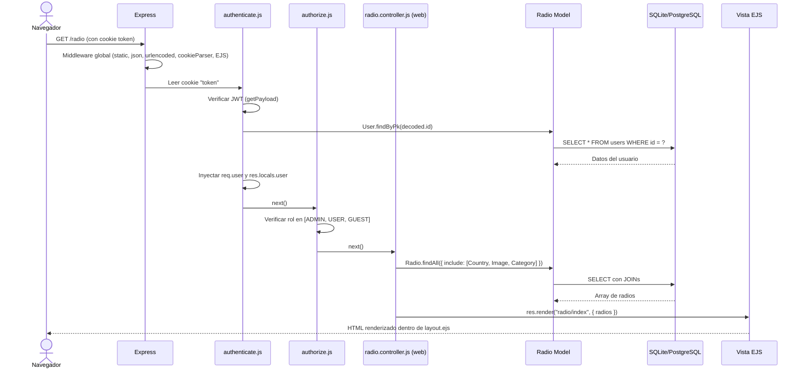
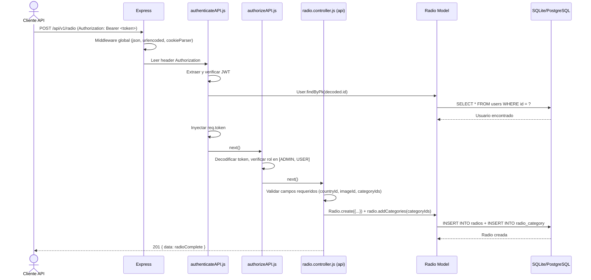
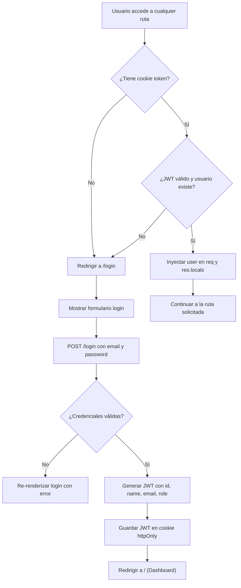
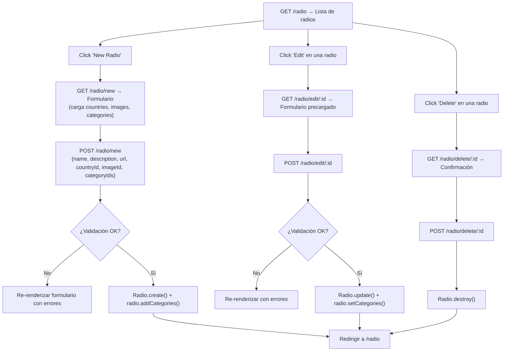

# Radios CMS

Sistema de gestión de contenido (CMS) para administrar estaciones de radio en línea. Permite gestionar radios, categorías, países e imágenes a través de un panel web con autenticación, y también expone una API REST para consumo programático.

---

## Tabla de Contenidos

- [¿Qué hace esta aplicación?](#qué-hace-esta-aplicación)
- [Stack tecnológico](#stack-tecnológico)
- [Arquitectura del proyecto](#arquitectura-del-proyecto)
- [Estructura de directorios](#estructura-de-directorios)
- [Requisitos previos](#requisitos-previos)
- [Instalación y configuración](#instalación-y-configuración)
- [Variables de entorno](#variables-de-entorno)
- [Scripts npm](#scripts-npm)
- [Base de datos](#base-de-datos)
- [Autenticación y autorización](#autenticación-y-autorización)
- [Flujo de una petición HTTP](#flujo-de-una-petición-http)
- [Rutas Web (Panel de administración)](#rutas-web-panel-de-administración)
- [API REST](#api-rest)
- [Sistema de vistas (EJS)](#sistema-de-vistas-ejs)
- [Internacionalización (i18n)](#internacionalización-i18n)
- [Subida de archivos](#subida-de-archivos)
- [Flujos funcionales principales](#flujos-funcionales-principales)
- [Dependencias principales](#dependencias-principales)

---

## ¿Qué hace esta aplicación?

Radios CMS es un panel de administración web que permite:

- **Gestionar estaciones de radio**: crear, editar, ver y eliminar radios con su nombre, descripción, URL de streaming, país de origen, imagen y categorías asociadas.
- **Gestionar categorías**: CRUD completo de categorías que clasifican las radios (ej. Rock, Pop, Jazz).
- **Gestionar países**: CRUD completo de países con nombre y código ISO.
- **Gestionar imágenes**: subir imágenes al servidor y asociarlas como logos/iconos de las radios.
- **Gestionar usuarios**: crear y eliminar usuarios con roles diferenciados (`admin`, `user`, `guest`).
- **Autenticación**: login con email/contraseña protegido con JWT almacenado en cookies.
- **API REST**: todos los recursos están disponibles también vía endpoints JSON bajo `/api/v1`.

---

## Stack tecnológico

| Tecnología | Propósito |
|---|---|
| **Node.js** (ES Modules) | Entorno de ejecución |
| **Express 4** | Framework HTTP / Servidor web |
| **Sequelize 6** | ORM para acceso a base de datos |
| **SQLite** | Base de datos en desarrollo |
| **PostgreSQL** | Base de datos en producción |
| **EJS** + **express-ejs-layouts** | Motor de plantillas y sistema de layouts |
| **Flowbite** (Tailwind CSS) | Framework de UI (CDN) |
| **JWT** (jsonwebtoken) | Tokens de autenticación |
| **bcrypt** | Hashing de contraseñas |
| **multer** | Subida de archivos |
| **i18n** | Internacionalización |

---

## Arquitectura del proyecto

La aplicación sigue un patrón **MVC (Model-View-Controller)** con una separación clara entre la interfaz web y la API REST.



---

## Estructura de directorios

```
radios-cms/
├── index.js                    # Punto de entrada de la aplicación
├── server.js                   # Clase Server: configura Express, middleware, DB y rutas
├── package.json                # Dependencias y scripts npm
├── .env.example                # Plantilla de variables de entorno
├── .gitignore
│
├── .data/
│   └── db.sqlite               # Base de datos SQLite (desarrollo)
│
├── src/
│   ├── config/
│   │   ├── config.js           # Carga de variables de entorno con valores por defecto
│   │   ├── i18n.js             # Configuración de internacionalización (en/es)
│   │   └── storage.js          # Configuración de multer para subida de imágenes
│   │
│   ├── controllers/
│   │   ├── api/                # Controladores que responden JSON
│   │   │   ├── auth.controller.js
│   │   │   ├── category.controller.js
│   │   │   ├── country.controller.js
│   │   │   ├── image.controller.js
│   │   │   ├── radio.controller.js
│   │   │   └── user.controller.js
│   │   │
│   │   └── web/                # Controladores que renderizan vistas EJS
│   │       ├── auth.controller.js
│   │       ├── main.controller.js
│   │       ├── category.controller.js
│   │       ├── country.controller.js
│   │       ├── image.controller.js
│   │       ├── radio.controller.js
│   │       └── user.controller.js
│   │
│   ├── db/
│   │   └── dbConfig.js         # Conexión Sequelize (SQLite en dev, PostgreSQL en prod)
│   │
│   ├── locales/
│   │   ├── en.json             # Traducciones en inglés
│   │   └── es.json             # Traducciones en español
│   │
│   ├── middlewares/
│   │   ├── authenticate.js     # Autenticación web (lee JWT de cookie)
│   │   ├── authenticate.api.js # Autenticación API (lee JWT de header Authorization)
│   │   ├── authorize.js        # Autorización web (verifica roles, renderiza error)
│   │   └── authorize.api.js    # Autorización API (verifica roles, responde JSON)
│   │
│   ├── models/
│   │   ├── user.js             # Modelo User + enum Role + hooks de hashing
│   │   ├── radio.js            # Modelo Radio + relaciones (Country, Image, Category)
│   │   ├── category.js         # Modelo Category
│   │   ├── country.js          # Modelo Country
│   │   └── image.js            # Modelo Image
│   │
│   ├── routes/
│   │   ├── api/                # Rutas REST (/api/v1/*)
│   │   │   ├── index.js        # Registra todas las rutas API con authenticateAPI
│   │   │   ├── auth.router.js
│   │   │   ├── category.router.js
│   │   │   ├── country.router.js
│   │   │   ├── image.router.js
│   │   │   ├── radio.router.js
│   │   │   └── user.router.js
│   │   │
│   │   └── web/                # Rutas web (/*)
│   │       ├── index.js        # Registra todas las rutas web con authenticate
│   │       ├── auth.router.js
│   │       ├── main.router.js
│   │       ├── category.router.js
│   │       ├── country.router.js
│   │       ├── image.router.js
│   │       ├── radio.router.js
│   │       └── user.router.js
│   │
│   └── utils/
│       └── crypto.js           # hashPassword, comparePassword, generateToken, getPayload
│
└── views/
    ├── layout.ejs              # Layout principal (navbar + sidebar + <%- body %>)
    ├── index.ejs               # Dashboard con tarjetas de acceso rápido
    ├── auth/
    │   └── login.ejs           # Página de login (sin layout)
    ├── category/
    │   ├── index.ejs           # Listado de categorías
    │   ├── new.ejs             # Formulario de creación
    │   ├── edit.ejs            # Formulario de edición
    │   ├── show.ejs            # Detalle de categoría
    │   └── delete.ejs          # Confirmación de eliminación
    ├── country/                # (misma estructura que category)
    ├── radio/                  # (misma estructura que category)
    ├── image/
    │   ├── index.ejs           # Listado de imágenes
    │   ├── new.ejs             # Formulario de subida
    │   └── delete.ejs          # Confirmación de eliminación
    ├── user/
    │   ├── index.ejs           # Listado de usuarios
    │   ├── new.ejs             # Formulario de creación
    │   └── delete.ejs          # Confirmación de eliminación
    └── shared/
        ├── error_401.ejs       # No autenticado
        ├── error_403.ejs       # Sin permisos
        ├── error_404.ejs       # No encontrado
        └── error_500.ejs       # Error interno del servidor
```

---

## Requisitos previos

- **Node.js** (versión compatible con ES Modules)
- **npm**
- **PostgreSQL** (solo para producción)

---

## Instalación y configuración

```bash
# 1. Clonar el repositorio
git clone https://github.com/DarCkly666/radios-cms.git
cd radios-cms

# 2. Instalar dependencias
npm install

# 3. Crear el archivo de configuración
cp .env.example .env
# Editar .env con los valores deseados

# 4. Iniciar el servidor
npm run dev    # Desarrollo (con --watch)
npm start      # Producción
```

> **Nota:** En modo desarrollo (`NODE_ENV=development`), la aplicación usa SQLite automáticamente con un archivo en `.data/db.sqlite`. No requiere configurar PostgreSQL. Las tablas se crean y sincronizan automáticamente al iniciar gracias a `connection.sync({ alter: true })`.

---

## Variables de entorno

| Variable | Descripción | Valor por defecto |
|---|---|---|
| `PORT` | Puerto del servidor HTTP | `3000` |
| `DB_HOST` | Host de PostgreSQL (producción) | `localhost` |
| `DB_PORT` | Puerto de PostgreSQL | `5432` |
| `DB_NAME` | Nombre de la base de datos | `radios` |
| `DB_USER` | Usuario de PostgreSQL | `postgres` |
| `DB_PASS` | Contraseña de PostgreSQL | `postgres` |
| `NODE_ENV` | Entorno de ejecución (`development` / `production`) | `development` |
| `SALT_ROUNDS` | Rondas de hashing bcrypt | `10` |
| `JWT_SECRET` | Clave secreta para firmar JWT | `super_secret_key` |

---

## Scripts npm

| Script | Comando | Descripción |
|---|---|---|
| `npm start` | `node index.js` | Inicia el servidor en modo producción |
| `npm run dev` | `node --watch index.js` | Inicia el servidor con recarga automática al detectar cambios |
| `npm test` | — | Placeholder, no hay tests implementados |

---

## Base de datos

### Selección de motor según entorno

- **Desarrollo** (`NODE_ENV !== 'production'`): usa **SQLite** con archivo local en `.data/db.sqlite`.
- **Producción** (`NODE_ENV === 'production'`): usa **PostgreSQL** con las credenciales de las variables de entorno.

### Modelo de datos



### Relaciones

| Relación | Tipo | Descripción |
|---|---|---|
| Country → Radio | 1:N | Un país tiene muchas radios |
| Image → Radio | 1:N | Una imagen puede ser usada por muchas radios |
| Radio ↔ Category | N:M | Una radio pertenece a múltiples categorías (tabla intermedia `radio_category`) |
| User | Independiente | No tiene relación directa con otras entidades |

### Validaciones en modelos

Cada modelo aplica validaciones con Sequelize que producen mensajes internacionalizados (vía i18n):

- **User**: nombre (2–100 chars), email (formato válido, único), password (8–60 chars), role (debe ser `admin`, `user` o `guest`).
- **Radio**: nombre (2–100 chars), descripción (2–1000 chars), url (formato URL válido, 2–500 chars).
- **Category**: nombre (2–100 chars, único).
- **Country**: nombre (2–100 chars, único), código (2–10 chars).
- **Image**: path (5–200 chars).

### Hooks del modelo User

- **`beforeCreate`**: hashea la contraseña automáticamente antes de guardar un nuevo usuario.
- **`beforeUpdate`**: hashea la contraseña solo si fue modificada.

---

## Autenticación y autorización

### Mecanismo de autenticación

La autenticación se basa en **JWT (JSON Web Tokens)** con dos canales de transporte según el tipo de cliente:



| Aspecto | Web | API |
|---|---|---|
| **Envío de credenciales** | `POST /login` (form) | `POST /api/v1/login` (JSON) |
| **Transporte del token** | Cookie `token` (httpOnly, secure en prod, sameSite: strict) | Header `Authorization: Bearer <token>` |
| **Middleware de autenticación** | `authenticate.js` | `authenticate.api.js` |
| **Fallo de autenticación** | Redirige a `/login` | Responde `401 JSON` |
| **Resultado exitoso** | Inyecta `req.user` y `res.locals.user` (sin password) | Inyecta `req.token` |

### Payload del JWT

El token contiene: `id`, `name`, `email`, `role` del usuario. Expira en **30 días**.

### Sistema de roles

Existen tres roles definidos en el enum `Role`:

| Rol | Lectura (GET) | Escritura (POST/PUT/DELETE) | Gestión de usuarios |
|---|---|---|---|
| `admin` | ✅ | ✅ | ✅ (crear/eliminar) |
| `user` | ✅ | ✅ | ❌ |
| `guest` | ✅ | ❌ | ❌ |

La autorización se aplica ruta por ruta mediante los middlewares `authorize(...roles)` (web) y `authorizeAPI(...roles)` (API), que verifican que el rol del usuario autenticado esté incluido en los roles permitidos.

### Logout

- **Web**: `POST /logout` → limpia la cookie `token` y redirige a `/login`.
- **API**: no existe endpoint de logout explícito (el token simplemente deja de usarse).

---

## Flujo de una petición HTTP

### Petición Web (ejemplo: `GET /radio`)



### Petición API (ejemplo: `POST /api/v1/radio`)



---

## Rutas Web (Panel de administración)

Todas las rutas web (excepto `/login`) requieren autenticación mediante el middleware `authenticate`.

### Auth

| Método | Ruta | Controlador | Descripción |
|---|---|---|---|
| GET | `/login` | `showLogin` | Muestra formulario de login |
| POST | `/login` | `login` | Procesa credenciales y crea cookie JWT |
| POST | `/logout` | `logout` | Elimina cookie y redirige a login |

### Dashboard

| Método | Ruta | Controlador | Descripción |
|---|---|---|---|
| GET | `/` | `main` | Dashboard con conteos de todas las entidades |

### Radios

| Método | Ruta | Roles lectura | Roles escritura | Controlador |
|---|---|---|---|---|
| GET | `/radio` | admin, user, guest | — | `getRadios` |
| GET | `/radio/new` | admin, user, guest | — | `showSave` |
| POST | `/radio/new` | — | admin, user | `save` |
| GET | `/radio/edit/:id` | admin, user, guest | — | `showEdit` |
| POST | `/radio/edit/:id` | — | admin, user | `edit` |
| GET | `/radio/delete/:id` | admin, user, guest | — | `showRemove` |
| POST | `/radio/delete/:id` | — | admin, user | `remove` |
| GET | `/radio/:id` | admin, user, guest | — | `showById` |

### Categorías, Países (mismo patrón)

| Método | Ruta | Descripción |
|---|---|---|
| GET | `/category` (o `/country`) | Listado |
| GET | `/category/new` | Formulario de creación |
| POST | `/category` | Guardar nuevo |
| GET | `/category/edit/:id` | Formulario de edición |
| POST | `/category/edit/:id` | Guardar cambios |
| GET | `/category/delete/:id` | Confirmación de eliminación |
| POST | `/category/delete/:id` | Ejecutar eliminación |
| GET | `/category/:id` | Detalle |

### Imágenes

| Método | Ruta | Descripción |
|---|---|---|
| GET | `/image` | Listado de imágenes |
| GET | `/image/new` | Formulario de subida |
| POST | `/image/new` | Subir imagen (multipart, middleware `multer`) |
| GET | `/image/delete/:id` | Confirmación de eliminación |
| POST | `/image/delete/:id` | Eliminar imagen (registro + archivo físico) |

### Usuarios

| Método | Ruta | Roles escritura | Descripción |
|---|---|---|---|
| GET | `/user` | — | Listado |
| GET | `/user/new` | — | Formulario de creación |
| POST | `/user/new` | admin | Crear usuario |
| GET | `/user/delete/:id` | — | Confirmación |
| POST | `/user/delete/:id` | admin | Eliminar usuario |

---

## API REST

Prefijo base: **`/api/v1`**

Todas las rutas (excepto login) requieren el header `Authorization: Bearer <token>`.

### Autenticación

| Método | Ruta | Body | Respuesta |
|---|---|---|---|
| POST | `/api/v1/login` | `{ email, password }` | `{ token: "JWT..." }` |

### Recursos CRUD

La API sigue un patrón RESTful consistente para cada recurso:

| Método | Ruta | Roles | Descripción |
|---|---|---|---|
| GET | `/api/v1/{recurso}` | admin, user, guest | Listar todos |
| GET | `/api/v1/{recurso}/:id` | admin, user, guest | Obtener por ID |
| POST | `/api/v1/{recurso}` | admin, user* | Crear |
| PUT | `/api/v1/{recurso}/:id` | admin, user* | Actualizar |
| DELETE | `/api/v1/{recurso}/:id` | admin, user* | Eliminar |

\* Excepción para `/api/v1/user`: crear, actualizar y eliminar requieren rol `admin`.

**Recursos disponibles:** `radio`, `category`, `country`, `image`, `user`.

### Formato de respuestas

```json
// Éxito
{ "data": { ... } }

// Error de validación
{ "errors": ["Name is required", "URL is not valid"] }

// No encontrado
{ "errors": ["Radio not found"] }
```

### Crear/Editar Radio (ejemplo)

```json
// POST /api/v1/radio
{
  "name": "Rock FM",
  "description": "La mejor estación de rock",
  "url": "https://stream.rockfm.com/live",
  "countryId": 1,
  "imageId": 3,
  "categoryIds": [1, 4, 7]
}
```

### Subir Imagen (API)

```
POST /api/v1/image
Content-Type: multipart/form-data

Campo: "image" (archivo)
```

---

## Sistema de vistas (EJS)

### Layout principal

`views/layout.ejs` actúa como layout maestro para todas las vistas web (excepto login y error_500, que usan `{ layout: false }`). Contiene:

- **Navbar superior fija**: logo "Radios", botón de menú responsive, menú de usuario (nombre, email, botón Sign out).
- **Sidebar lateral**: enlaces de navegación a Dashboard, Category, Country, Image, Radio y User.
- **Área de contenido**: `<%- body %>` donde se inyecta el contenido específico de cada página.
- **Flowbite (CDN)**: CSS y JS de Flowbite para componentes con estilo Tailwind.

### Variables disponibles en las vistas

El middleware `authenticate` inyecta `res.locals.user` (nombre, email, rol) que está disponible automáticamente en todas las vistas que usan el layout. Cada controlador pasa datos adicionales:

| Vista | Variables principales |
|---|---|
| `index.ejs` (dashboard) | `categories`, `countries`, `images`, `radios`, `users` |
| `radio/index.ejs` | `radios` (con country, image, categories incluidos) |
| `radio/new.ejs` | `countries`, `images`, `categories`, `errors` (opcional) |
| `radio/edit.ejs` | `radio`, `countries`, `images`, `categories`, `errors` (opcional) |
| `radio/show.ejs` | `radio` (con relaciones) |
| `radio/delete.ejs` | `radio` |
| `category/index.ejs` | `categories`, `lblCategories`, `lblNew`, `lblEdit`, etc. |
| `user/index.ejs` | `users`, `labels` (objeto con traducciones) |
| `user/new.ejs` | `labels`, `roles`, `errors` (opcional) |
| `auth/login.ejs` | `labels`, `errors` (opcional) |

### Mapa de vistas

```
views/
├── layout.ejs ─────────────── Layout con navbar + sidebar (usa Flowbite/Tailwind)
├── index.ejs ──────────────── Dashboard: tarjetas con links a cada sección
│
├── auth/
│   └── login.ejs ──────────── Login standalone (layout: false), formulario email/password
│
├── category/
│   ├── index.ejs ──────────── Tabla con listado de categorías
│   ├── new.ejs ────────────── Formulario de creación
│   ├── edit.ejs ───────────── Formulario de edición (precargado)
│   ├── show.ejs ───────────── Detalle de una categoría
│   └── delete.ejs ─────────── Confirmación de eliminación
│
├── country/ ───────────────── (misma estructura que category)
├── radio/ ─────────────────── (misma estructura, con campos adicionales)
├── image/ ─────────────────── index, new, delete (sin edit ni show)
├── user/ ──────────────────── index, new, delete (sin edit)
│
└── shared/
    ├── error_401.ejs ──────── "401 Unauthorized"
    ├── error_403.ejs ──────── "403 Forbidden"
    ├── error_404.ejs ──────── "404 Not Found"
    └── error_500.ejs ──────── "500 Internal Server Error" (con ícono SVG)
```

---

## Internacionalización (i18n)

La aplicación soporta **inglés** (por defecto) y **español** mediante la librería `i18n`.

Los archivos de traducción se encuentran en `src/locales/` y contienen tres secciones:

- **`validations`**: mensajes de validación de modelos y formularios.
- **`errors`**: mensajes de error HTTP (400, 401, 404, 500).
- **`titles`**: etiquetas de la interfaz (botones, encabezados de tablas, formularios).
- **`messages`**: mensajes de confirmación y feedback.

Los controladores web cargan las traducciones usando `i18n.__('clave')` y las pasan a las vistas como variables (ej. `labels`). Los modelos Sequelize también usan i18n para los mensajes de validación.

---

## Subida de archivos

Las imágenes se suben mediante **multer** con almacenamiento en disco:

- **Destino**: `public/uploads/images/`
- **Nombre del archivo**: `{fieldname}-{timestamp}-{random}{extensión}` (ej. `image-1704067200000-123456789.png`)
- **Campo del formulario**: `image`
- **Almacenamiento en DB**: se guarda la ruta relativa (sin el prefijo `public/`) en el campo `path` del modelo `Image`.
- **Servido estáticamente**: Express sirve la carpeta `public/` como estática, por lo que las imágenes son accesibles vía `/{path}`.
- **Eliminación**: al eliminar una imagen, el controlador borra tanto el registro de la BD como el archivo físico del disco.

---

## Flujos funcionales principales

### 1. Login y acceso al panel



### 2. CRUD de una radio (web)



### 3. Subida y asociación de imagen

1. El usuario accede a `/image/new` y sube un archivo de imagen.
2. Multer procesa el `multipart/form-data`, guarda el archivo en `public/uploads/images/` y coloca la ruta en `req.filename`.
3. El controlador crea un registro `Image` con esa ruta.
4. Al crear o editar una radio, se selecciona una imagen existente por su ID.
5. La imagen se muestra en las vistas usando `">`.

---

## Dependencias principales

| Paquete | Versión | Propósito |
|---|---|---|
| `express` | 4.21.2 | Framework web HTTP |
| `sequelize` | 6.37.5 | ORM para modelado de datos y consultas |
| `sqlite3` | 5.1.7 | Driver SQLite para desarrollo |
| `pg` + `pg-hstore` | 8.13.3 / 2.3.4 | Driver PostgreSQL para producción |
| `ejs` | 3.1.10 | Motor de plantillas HTML |
| `express-ejs-layouts` | 2.5.1 | Soporte de layouts maestros para EJS |
| `jsonwebtoken` | 9.0.2 | Generación y verificación de JWT |
| `bcrypt` | 5.1.1 | Hashing seguro de contraseñas |
| `cookie-parser` | 1.4.7 | Parseo de cookies en peticiones HTTP |
| `multer` | 1.4.5-lts.1 | Procesamiento de uploads multipart |
| `dotenv` | 16.4.7 | Carga de variables de entorno desde `.env` |
| `i18n` | 0.15.1 | Internacionalización (inglés y español) |
| `standard` | 17.1.2 | _(dev)_ Linter JavaScript (StandardJS) |

---

## Servicios externos

La aplicación **no depende de servicios externos** para su funcionalidad core. Todo se ejecuta localmente:

- La base de datos es local (SQLite en desarrollo, PostgreSQL autoalojado en producción).
- Las imágenes se almacenan en el filesystem del servidor.
- No se consumen APIs de terceros.

Los únicos recursos externos son los **CDN de Flowbite** (CSS y JS) cargados en las vistas para el framework de UI.
